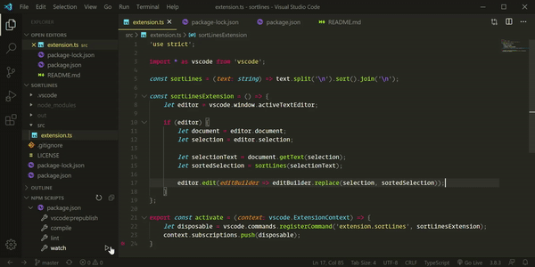

# VSCode Back and Forward Buttons

##### Visual Studio like back and forward button support for Visual Studio Code.

## Demo

## Installing

- Download the extension from the [VisualStudio Marketplace](https://marketplace.visualstudio.com/items?itemName=baileyfirman.vscode-back-forward-buttons)

## Building
- Compile and Run this Extension
  - `npm install`
  - F5 to run and debug the extension
